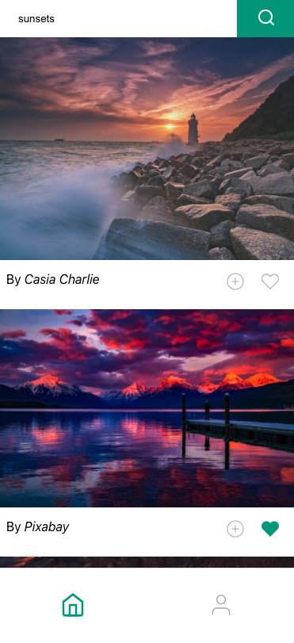
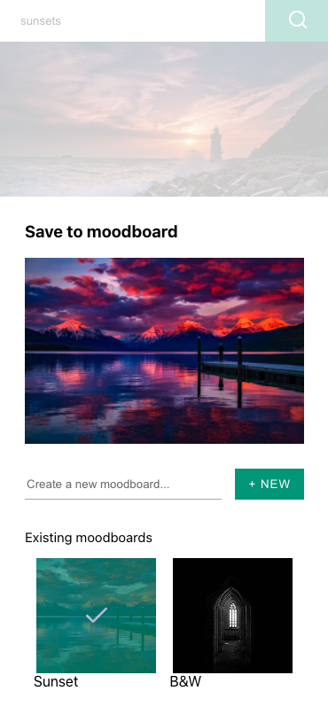
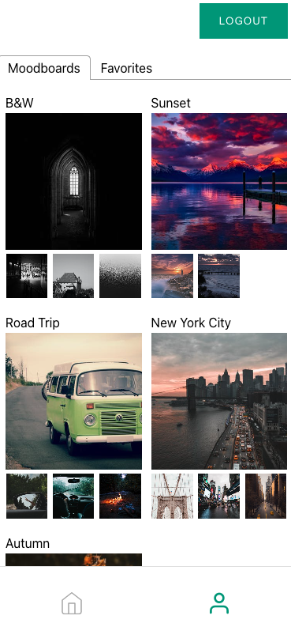

# Moodboard app

A PWA moodboard app in React ⚛️

Deployed on Netlify 🚀

[](https://moodboard.codebynao.tech)

URL: https://moodboard.codebynao.tech

> (don't forget to check this in a **mobile format** if you don't want to be shocked by the non-responsive design)

I used the [Pexels API](https://www.pexels.com/api/) for the photos

## 📸 Preview of the app

### Feed with a search bar


### Save a photo to a moodboard


### Moodboards page



## ⚙️ Prerequisites

To run the project locally, you'll need to get [Pexels API Key](https://www.pexels.com/api/documentation/#authorization) in order to fetch the photos for the app

## 🚀 Quick start

1.  **Clone the git repository**

```bash
# cloning git repository into a new `moodboard` folder
git clone https://github.com/codebynao/moodboard-app.git moodboard

# install project dependencies
cd moodboard && npm install
```


2. **Setup Environment variables**
```
REACT_APP_API_BASE_URL=https://api.pexels.com/v1
REACT_APP_API_KEY=xxxxx
REACT_APP_LOGIN_URL=xxxxx
```

3.  **Start Developing**

**Development version**

```bash
npm start
```

**Production version**

```bash
npm run build
```

4.  **Checkout the project!**

> Project is running at http://localhost:3000

## ✏️ Author

Naomi Paulmin - [@codebynao](https://github.com/codebynao) 

### 📬 Contact

[](https://www.linkedin.com/in/naomi-paulmin/) [](https://twitter.com/codebynao)

| ✉️ | naomi.paulmin@gmail.com |
| :-----: | :---------------------: |
